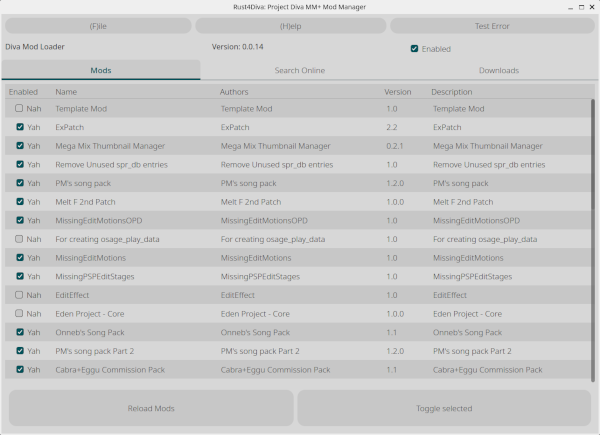
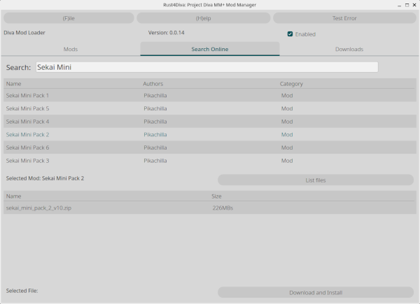

# Rust4Diva

A Fast cross-platform mod manager written in rust for the steam version of Hatsune Miku Project Diva Mega Mix +

Toggle mods

Get new mods online directly in the app

# Planned Features / To-Do List
- [ ] Mod pack presets for easy switching between incompatible mods
  - Need to decide on a format for the modpacks
    - Probably a json file
- [x] Windows Support
  - [x] Finding the Diva Folder
  - [x] Oneclick URL Handling
- [x] MacOS Support
  - [x] ~~Literally just finding someone with a mac to test this~~ 
    - Thank you @zachw000
    - This was only tested on MacOS on Arm though, you can't even install Mega Mix plus using the regular version of steam though.
  - [ ] Url handling
    - Not sure how this works on MacOS
- [x] Commission a proper logo/icon
  - Logo is being made, just waiting now, Ty Nezuko