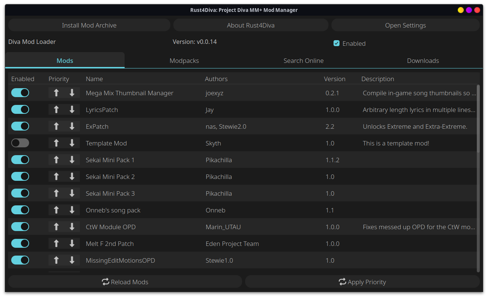
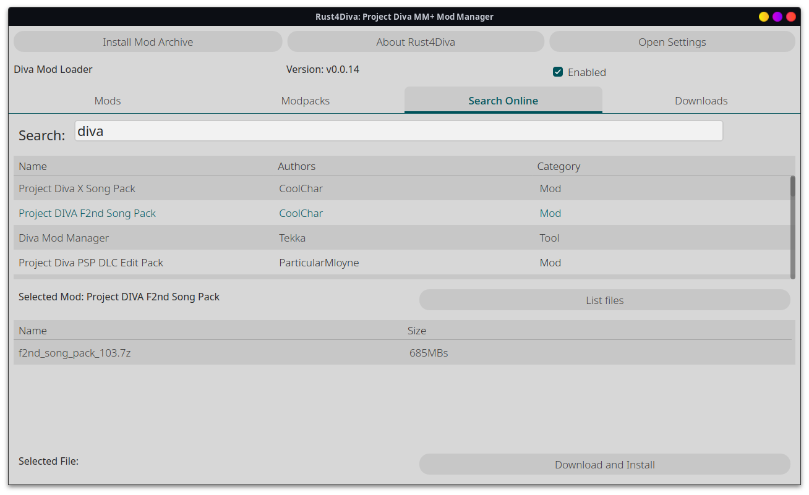

# Rust4Diva

A Fast cross-platform mod manager written in rust for the steam version of Hatsune Miku Project Diva Mega Mix +

Toggle mods



Get new mods online directly in the app



# Planned Features / To-Do List
- [ ] Mod pack presets for easy switching between incompatible mods
  - [x] [Pack format](#Modpack-JSON-Format) has been decided on
    - [x] Json containing packname and a list of the modfolders included in the pack used as the priority order

  - [x] Modifying and applying packs
  - [x] In app creation of new modpacks
  - [ ] In app deletion of existing modpacks
- [x] Windows Support
  - [x] Finding the Diva Folder
  - [x] Oneclick URL Handling
  - [ ] Signed binary
  - [ ] Icon set on executable
- [x] MacOS Support
  - [x] ~~Literally just finding someone with a mac to test this~~ 
    - Thank you @zachw000
    - This was only tested on MacOS on Arm though, you can't even install Mega Mix plus using the regular version of steam though.
  - [ ] Url handling
    - Not sure how this works on MacOS
  - [ ] Rebuilt Distributable
    - I personally will be unable to sign this since I don't have a mac nor do I want to pay the $100 a year or whatever it is to apple for the privledge
- [x] Commission a proper logo/icon
  - Logo is being made, just waiting now, Ty Nezuko

## Modpack JSON Format
```json
{
  "name": "Example Pack",
  "mods": [
    {
      "name": "test",
      "enabled": true, // this currently doesn't do anything
      "path":"/absolute/path/to/mod"
    }
  ]
}
```


# License
Code: GPL-3.0 unless specified

Artwork: All Rights Reserved (Use allowed in packaging the application)
Logo Artist: Shibabe